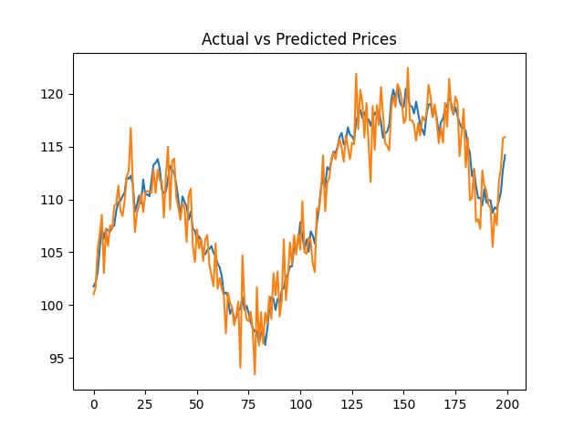
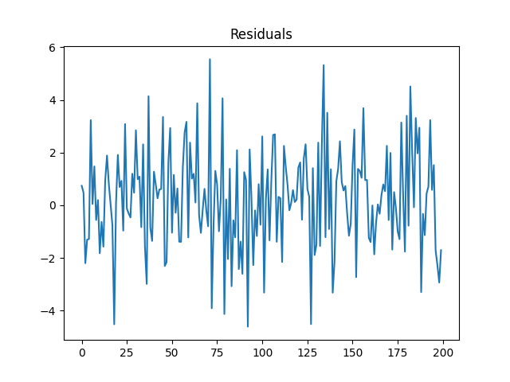
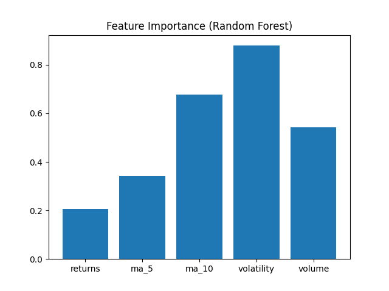

# JSE Stock Price Prediction using Machine Learning

## Overview

This project explores the use of machine learning techniques to predict next-day closing prices of stocks listed on the Johannesburg Stock Exchange (JSE).

The aim is not to build a perfect trading system, but to understand how financial data can be transformed into meaningful features and used in predictive models.

---

## Motivation

As a student interested in data science and quantitative finance, I wanted to build a project that combines:

- financial data analysis  
- machine learning  
- practical Python implementation  

I chose the JSE to keep the project locally relevant and aligned with South African financial markets.

---

## Data

The data is obtained using the `yfinance` library and consists of historical daily stock data, including:

- Open price  
- High price  
- Low price  
- Close price  
- Adjusted close  
- Volume  

The default stock used in this project is:

**SBK.JO (Standard Bank Group)**

---

## Feature Engineering

Several features were constructed from the raw price data to capture market behaviour:

- Daily returns  
- Lagged closing prices  
- Rolling averages (5-day and 10-day)  
- Rolling volatility  
- Momentum indicators  
- Volume changes  

These features help the models identify trends and short-term patterns in the data.

---

## Models Used

Two models were implemented and compared:

### Linear Regression
- Serves as a baseline model  
- Assumes a linear relationship between features and price  

### Random Forest Regressor
- Captures non-linear relationships  
- More flexible and better suited for complex patterns  

---

## Evaluation Metrics

Model performance was evaluated using:

- Mean Absolute Error (MAE)  
- Root Mean Squared Error (RMSE)  
- \(R^2\) score  
- Directional accuracy (whether the model predicts the correct movement of price)  

---

## Results

Example outputs generated by the models include:

### Actual vs Predicted Prices


### Residuals


### Feature Importance (Random Forest)


The Random Forest model generally performed better than Linear Regression, suggesting that non-linear relationships are important in stock price behaviour.

---

## Project Structure

```text
jse-ml-stock-prediction/
│
├── src/
│ ├── data_loader.py
│ ├── features.py
│ ├── plotting.py
│ └── train.py
│
├── results/
│ ├── *.png
│ └── metrics.csv
│
├── requirements.txt
├── README.md
```

## How to run

### 1. Clone the repository

```bash
git clone https://github.com/Amogelang04/jse-ml-stock-prediction.git
cd jse-ml-stock-prediction
```

### 2. Create and activate a virtual environment

```bash
python -m venv .venv
```

On Windows:

```bash
.venv\Scripts\activate
```

On Mac/Linux:

```bash
source .venv/bin/activate
```

### 3. Install dependencies

```bash
pip install -r requirements.txt
```

### 4. Run the training script

```bash
python src/train.py
```

## Default setup

The script currently uses:
- ticker: `SBK.JO` (Standard Bank Group)
- training window: historical daily data from 2018 onward
- target: next-day closing price

You can change the ticker inside `src/train.py` if you want to test another JSE stock such as:
- `NPN.JO`
- `AGL.JO`
- `SOL.JO`
- `FSR.JO`

## Outputs

After running the project, the script saves:
- cleaned historical data in `data/`
- model comparison metrics in `results/model_metrics.csv`
- prediction plots in `results/`

## Example evaluation metrics

The project reports:
- MAE
- RMSE
- R²
- Directional Accuracy

## Possible next steps

A few realistic improvements for future work:
- try classification for up/down movement,
- use walk-forward validation,
- add technical indicators such as RSI or MACD,
- compare more models such as XGBoost,
- include macroeconomic or market index features.

## Disclaimer

This project is for learning and portfolio purposes only. It is not financial advice and it should not be used on its own for investment decisions.
